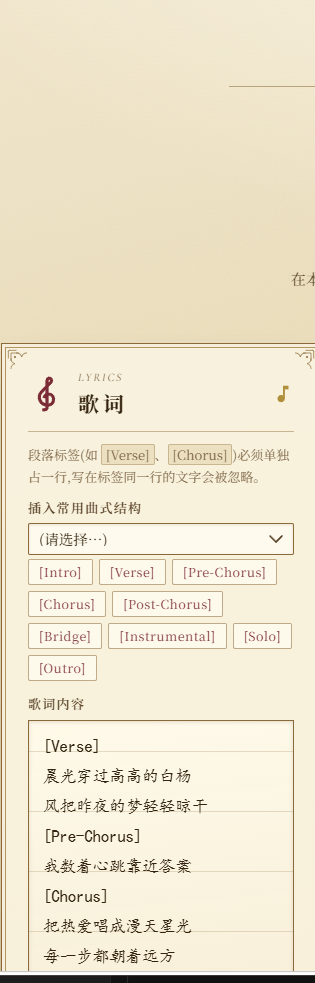
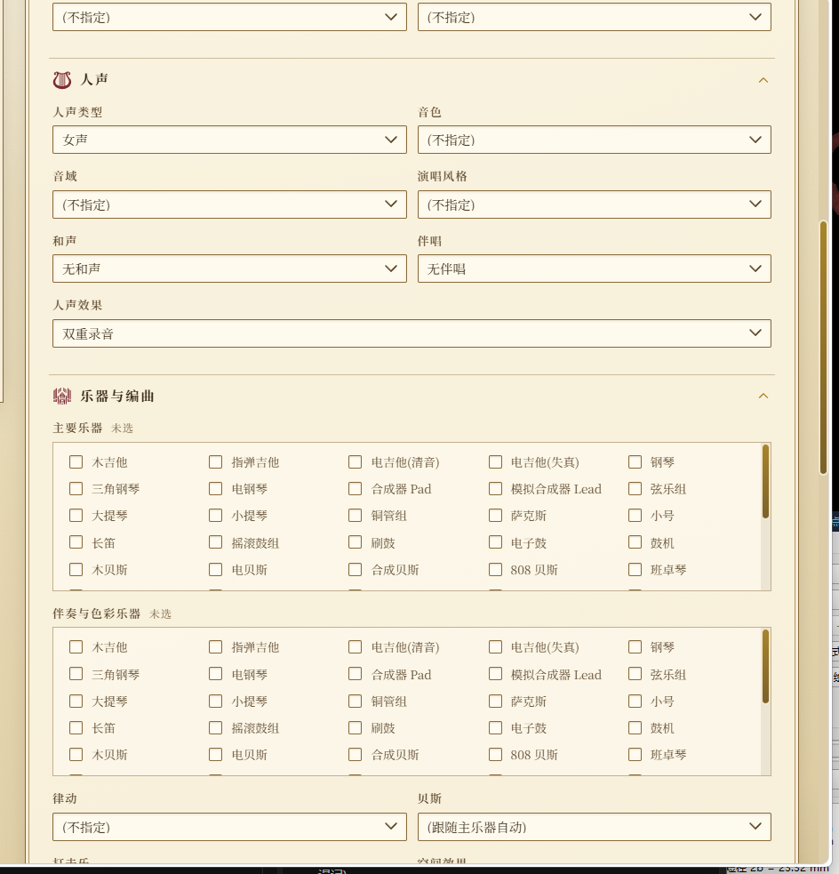
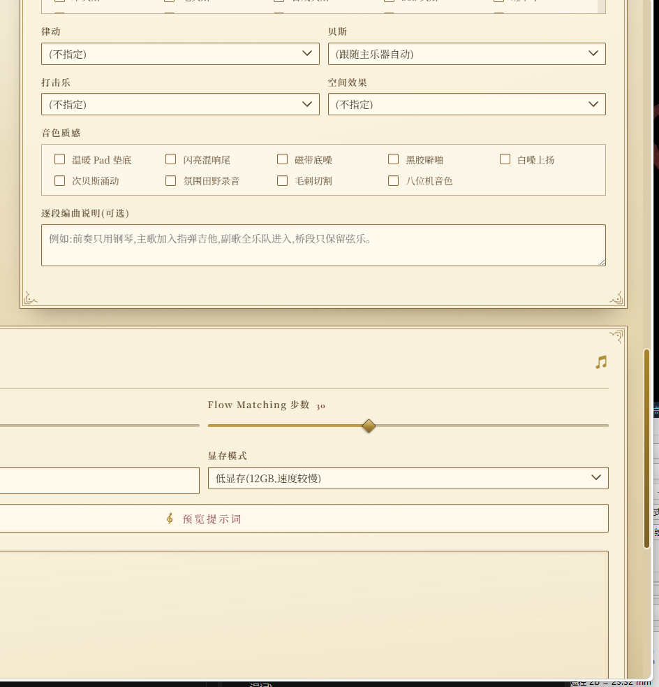
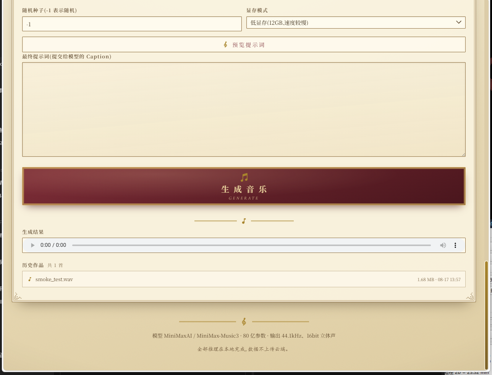

<div align="center">

# MiniMax Music 3 · 本地音乐生成工作站

**基于开源模型 [MiniMaxAI/MiniMax-Music3](https://huggingface.co/MiniMaxAI/MiniMax-Music3) 的本地歌曲生成应用**

羊皮纸 × 雕版金 × 勃艮第 —— 一座跑在自家显卡上的巴洛克音乐工房

[](https://www.python.org/)
[](https://pytorch.org/)
[](https://github.com/huggingface/diffusers/pull/14456)
[](https://fastapi.tiangolo.com/)
[](https://www.gradio.app/)
[]()
[]()
[]()

[功能特性](#-功能特性) · [界面预览](#-界面预览) · [快速开始](#-快速开始) · [参数一览](#-输入参数一览) · [性能实测](#-性能实测rtx-3060-12gb) · [目录结构](#-目录结构)

</div>

---

## ✨ 功能特性

- **双前端入口** —— 巴洛克工房(FastAPI + 原生前端,推荐)与 Gradio 版一键切换,共用同一套推理封装
- **全参数音乐描述** —— 流派、子风格、BPM、调性音阶、情绪推进、聆听场景、制作质感、人声、编曲逐项可调,自动组装为结构化 Caption
- **结构化歌词编辑** —— 6 种曲式骨架一键插入,9 种段落标签快捷按钮,中英文歌词皆可
- **实时生成进度** —— SSE 流式日志,模型加载、显存调度、生成阶段逐条推送
- **种子级复现** —— 固定随机种子 + 相同输入可完整复现同一演绎
- **曲库卷宗** —— 生成结果自动落盘 `outputs/`,界面内直接播放与回听
- **低显存方案** —— 全组件自动 CPU offload 叠加语言模型逐层流式搬运,12GB 显存即可驱动 8B 模型

## 🖼️ 界面预览

### 巴洛克工房总览


乐器饰带、雕版标题与双栏工作台:左侧歌词手稿,右侧音乐描述参数体系。

### 功能分区

| 歌词编辑 | 人声与乐器配置 |
|:---:|:---:|
|  |  |
| 段落标签说明、曲式骨架插入、快捷标签按钮与歌词编辑框 | 人声七维配置与 48 种乐器的双选编曲矩阵 |

| 律动与质感层 | 生成结果与曲库 |
|:---:|:---:|
|  |  |
| 律动、贝斯、打击乐、空间效果与音色质感勾选 | 最终提示词、生成按钮、播放器与历史作品卷宗 |

## 🧭 模型概况

| 项目 | 内容 |
| --- | --- |
| 架构 | 8B 全局 LLM(Qwen3-8B 初始化,建模长程音乐结构)+ 0.6B 局部 LLM(帧级声学细节)+ Flow Matching(2.4B)+ Flow-VAE(123M)解码 |
| 输入 | 歌词(带段落标签)+ 音乐描述(结构化 Caption) |
| 输出 | 44.1 kHz、16-bit 立体声 WAV,单次最长 6 分钟(9000 声学帧) |
| 提示词上限 | 5000 tokens(prompt + lyrics 合并计算) |
| 许可 | 见[模型页 LICENSE](https://huggingface.co/MiniMaxAI/MiniMax-Music3) |

> 段落标签与音乐描述属于生成性引导,速度、调性、配器可能存在偏差。

## 🚀 快速开始

### 环境要求

| 项目 | 要求 |
| --- | --- |
| Python | 3.10 及以上(本项目在 3.13 验证) |
| 显卡 | NVIDIA,显存 12GB 起步(低显存模式);22GB 以上可切标准模式提速 |
| 磁盘 | 权重约 26.5 GB(diffusers 组件),另留生成产物空间 |
| 系统 | Windows / Linux 皆可 |

### 安装步骤

```bash
# 1. 克隆本仓库并创建虚拟环境
git clone <本仓库地址>
cd make-music
python -m venv .venv

# Windows
.venv\Scripts\activate
# Linux / macOS
# source .venv/bin/activate

# 2. 安装 PyTorch(CUDA 12.6;纯 CPU 亦可运行但速度更慢)
pip install torch --index-url https://download.pytorch.org/whl/cu126

# 3. 安装支持 MiniMax-Music3 的 diffusers(PR #14456,commit dafe373)
pip install "git+https://github.com/huggingface/diffusers@dafe3733fcfdbf3c48915fe77be3aef65b5d6a2d"

#    若 git 直连 GitHub 受阻,可改走 codeload tarball:
pip install https://codeload.github.com/huggingface/diffusers/tar.gz/dafe3733fcfdbf3c48915fe77be3aef65b5d6a2d

# 4. 安装其余依赖
pip install fastapi uvicorn gradio soundfile huggingface_hub transformers accelerate

# 5. 下载模型权重(约 26.5 GB,仅需 diffusers 组件目录)
hf download MiniMaxAI/MiniMax-Music3 --local-dir models/MiniMax-Music3
```

<details>
<summary><b>⚠️ 权重下载细节(点击展开)</b></summary>

Hugging Face 仓库中混有 diffusers 与 SGLang 两套格式。diffusers 路线仅需以下组件:

```
models/MiniMax-Music3/
├── language_model/     # 16 GB,4 个 safetensors 分片
├── transformer/        # 9 GB
├── condition_encoder/
├── rvq_depth_decoder/
├── scheduler/
├── tokenizer/
├── vocoder/
└── modular_model_index.json
```

`qwen_7B/`、`dav.pth`、`flowmatching_vae.pth` 属 SGLang 原始格式,可跳过(省约 21 GB)。

**本地加载注意**:`modular_model_index.json` 内组件路径若指向 HF 仓库 ID,需改写为本地绝对路径,否则组件加载为 `None` 并在 offload 阶段崩溃。
</details>

### 启动

```bash
# 巴洛克工房(推荐)→ http://127.0.0.1:7861
start_web.bat            # Windows
# .venv/bin/python app/server.py   # Linux

# Gradio 版 → http://127.0.0.1:7860
start_app.bat            # Windows
# .venv/bin/python app/app.py      # Linux
```

填写歌词(段落标签独占一行)→ 选择音乐描述参数 → 点击「生成音乐」。

## 🎛️ 输入参数一览

- **歌词区**:歌词文本、曲式骨架一键插入(标准流行 / 叙事民谣 / 纯器乐等 6 种)、9 种段落标签快捷按钮
- **风格预设**:温暖原声流行、深夜合成驰放、热血摇滚、国风戏韵、Lo-fi 学习节拍、爵士酒吧
- **全局元数据**:流派(21 类)、子风格、BPM(40–220 或自动)、调性(12 个)、音阶(7 种)、情绪推进(8 种)、聆听场景(10 种)、制作质感(8 种)
- **人声**:人声配置(女声 / 男声 / 对唱 / 童声 / 合唱 / 纯器乐)、音色(9 种)、音域(5 种)、演唱风格(10 种,含说唱、戏腔、R&B 转音)、和声(5 种)、伴唱(5 种)、人声效果(8 种)
- **编曲**:主奏乐器(48 种)、辅奏乐器、律动(11 种)、贝斯、打击乐(7 种)、质感层(9 种)、空间效果(8 种)、逐段编曲自由说明
- **生成**:时长(10–360 秒)、Flow Matching 步数(默认 30)、随机种子(-1 随机)、显存模式(低显存 / 标准)

<details>
<summary><b>📖 提示词组装原理(点击展开)</b></summary>

界面参数经 `caption_builder.py` 组装为英文结构化 Caption,与歌词合并后送入模型,合并上限 5000 tokens。可在「预览提示词」处查看最终 Caption,并支持手工改写后再生成。
</details>

## ⚡ 性能实测(RTX 3060 12GB)

| 阶段 | 耗时 | 说明 |
| --- | --- | --- |
| 权重加载(冷缓存) | 约 6 分钟 | 首次点击「生成」触发,此后常驻 |
| offload 配置 | 约 4–9 分钟 | 纯 CPU 阶段,GPU 占用 0% 属正常现象 |
| 音频生成 | 10 秒约 9 分钟 | 生成阶段 GPU 84–99%,显存约 4.9 GB |

显存策略:`ComponentsManager.enable_auto_cpu_offload` 全组件自动调度,叠加语言模型 `leaf_level` 逐层流式 offload(`use_stream=True`)。长时长作品请按比例预留生成时间,或使用 22GB 以上显存切换标准模式。

## 📁 目录结构

```
make-music/
├── app/
│   ├── app.py             # Gradio 主界面(7860 端口)
│   ├── server.py          # 巴洛克工房后端 FastAPI(7861 端口)
│   ├── inference.py       # 模型加载与推理封装
│   ├── caption_builder.py # 参数 → 结构化 Caption 组装
│   ├── presets.py         # 选项库(流派/乐器/人声/律动等映射表)
│   └── test_offline.py    # 离线自检脚本
├── web/                   # 巴洛克工房前端(index.html / style.css / app.js)
│   └── assets/            # 乐器与音符矢量素材(SVG,三色版)
├── docs/screenshots/      # README 界面截图
├── models/MiniMax-Music3/ # 模型权重(约 26.5 GB)
├── outputs/               # 生成结果(WAV)
├── research/              # diffusers PR 源码与分析脚本
├── start_app.bat          # Gradio 版一键启动
├── start_web.bat          # 巴洛克工房一键启动
└── .venv/                 # Python 虚拟环境
```

## 🔧 进阶配置

<details>
<summary><b>自定义模型路径</b></summary>

设置环境变量 `MINIMAX_MUSIC3_PATH` 指向权重目录即可,默认取项目内 `models/MiniMax-Music3`:

```bash
# Windows(PowerShell)
$env:MINIMAX_MUSIC3_PATH = "D:\models\MiniMax-Music3"

# Linux
export MINIMAX_MUSIC3_PATH=/data/models/MiniMax-Music3
```
</details>

<details>
<summary><b>注意事项</b></summary>

- 与段落标签同行的歌词文字会被模型输入契约丢弃,标签务必独占一行
- 更换随机种子可获得不同演绎;相同种子 + 相同输入可复现
- 界面矢量素材来自 [Iconify](https://iconify.design/) 公开图标库,经配色处理后本地化存放于 `web/assets/`
</details>

## 📜 许可

代码部分供学习研究使用;模型权重许可以 [MiniMaxAI/MiniMax-Music3 模型页](https://huggingface.co/MiniMaxAI/MiniMax-Music3) 公布的 LICENSE 为准。

---

<div align="center">

**全部推理在本地完成,数据不上传云端。**

`MiniMaxAI / MiniMax-Music3 · 80 亿参数 · 输出 44.1 kHz、16-bit 立体声`

</div>
